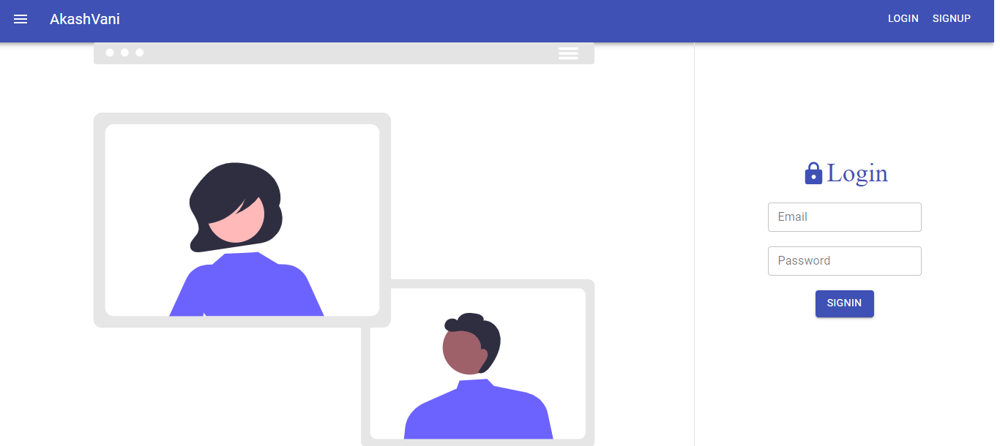

# AkashVani

This is a platform created in MERN stack with WEBRTC. This can be used as a platform to ogranise group meetups/conference with voice chats.

<p align="center">
 
&nbsp; &nbsp;
 
</p>

<p align="center">
 
&nbsp; &nbsp;
 
</p>

<p align="center">
 
&nbsp; &nbsp;
 
</p>

<p align="center">
 
&nbsp; &nbsp;
 
</p>

## Requirements

1. nodeJS >=14.15.4
2. npm >=6.14.10
3. mongodb

## Steps to init project

1.  First install all dependencies with npm:
    `npm install` in the root directory && `npm install` in the server directory.
2.  Create a `.env` file and insert the following code. Replace values with yours!!

    ### For root folder
        ```
        REACT_APP_BACKEND_URL="http://localhost:5000"
        ```
    ### For server folder
        ```
        SECRET_ACCESS_KEY="abc1234"
        SECRET_REFRESH_KEY="abc@1234"
        MONGOURI="mongodb://localhost/akasvani"
        ```
3.  ### Start the server for backend and frontend
    ### For frontend
    `npm start` in the root directory
    ### For backend
    Go to the server directory and run the command `npm run dev`
4.  Now load the app

    ```
    localhost:3000
    ```

6.  Enjoy!!
